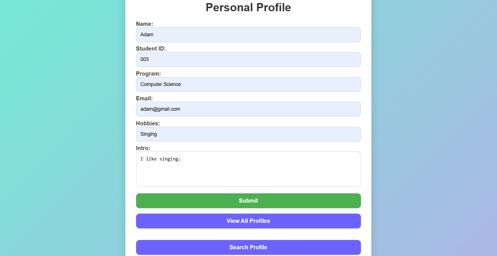
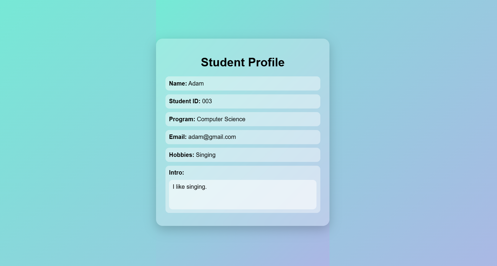
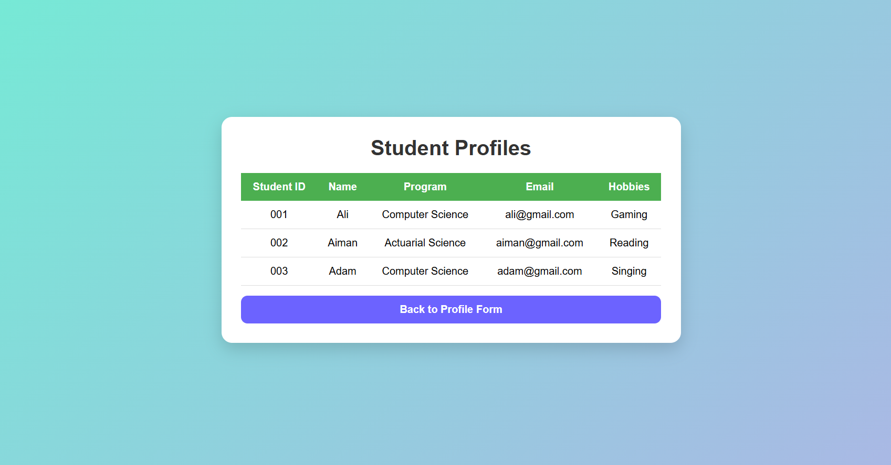
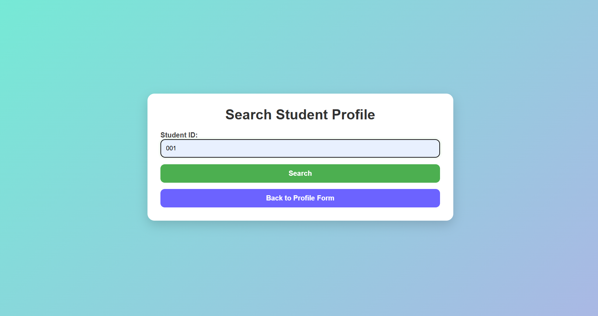
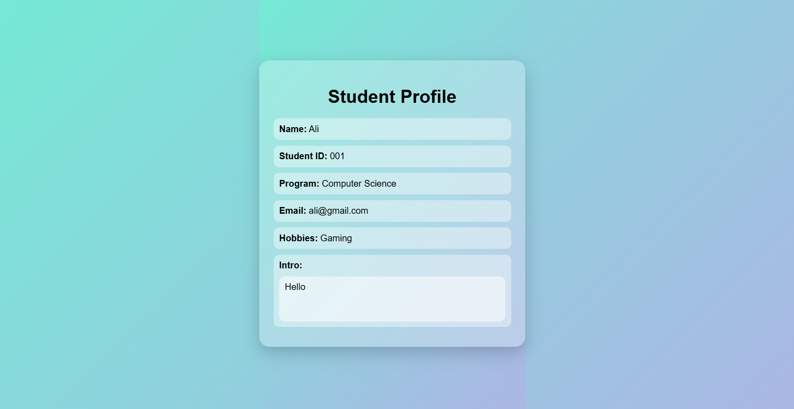

Name: Thierry Stephene Gampion
Student ID: 2024266988

Project Description:
Personal Profile App is a web-based application developed using HTML, Java Servlet, JavaBean, JSP, JDBC, and Java EE 7. The system allows users to create, store, view, and search student profile information. The application follows the MVC (Model-View-Controller) architecture, where JavaBean acts as the Model, JSP pages act as the View, and Servlet handles the Controller logic. Student profile data is stored and managed using a database.

Implemented Features:
Add and save student profile information into the database.
Display submitted student profile details.
View all student profiles stored in the database.
Search student profile using Student ID.
Connect application with database using JDBC.
Use MVC structure with Servlet, JavaBean, and JSP.
Apply CSS styling for a user-friendly interface.

Screenshots:
### Screenshot 1: [Main Menu]

### Screenshot 2: [Profile Card after Submit]

### Screenshot 3: [View All]

### Screenshot 4: [Search]

### Screenshot 5: [Profile Card after Search]

